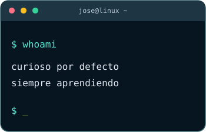

  

  <strong>Estudiante de Ingeniería de Sistemas</strong> · Bogotá, Colombia 
  Interesado en Arquitectura, QA, application support, cybersecurity y arquitectura de software.

  
  
  

**Open to:** prácticas, oportunidades trainee/junior, part-time y trabajo remoto, especialmente en QA, soporte de aplicaciones y áreas de tecnología donde pueda seguir aprendiendo.

## Un poco sobre mí

Me gusta estar ocupado. Si algo me da curiosidad, termino buscando documentación, probando herramientas o empezando un proyecto para entenderlo mejor. Disfruto tanto hacer que algo funcione como averiguar **por qué no funcionó a la primera**.

La **inteligencia artificial** es una de las cosas que más me gusta explorar: probar hasta dónde llega, descubrir sus límites y encontrar maneras de usarla para aprender, entender mejor un problema y potenciar lo que puedo hacer. No se trata solo de obtener una respuesta, sino de entenderla.

También me gustan **Linux, la ciberseguridad, el pentesting en entornos de práctica y documentar lo que voy aprendiendo**. Últimamente me ha despertado curiosidad la arquitectura de sistemas y la infraestructura. He probado un poco **AWS y Kubernetes**, pero todavía estoy empezando a profundizar en esos temas.

## Mi caja de herramientas

  

  
  
  

**Con lo que más experimento:** Linux, redes, pruebas de APIs, seguridad y documentación técnica.

**Ahora mismo explorando:** AWS, Kubernetes y arquitectura. Los estoy conociendo; no los presento como especialidades ni como certificaciones.

## Cosas que tengo entre manos

<table>
  <tr>
    <td width="50%" valign="top">
      <h3>🎟️ SupportDesk API</h3>
      
Una API REST para manejar tickets de soporte técnico. La estoy construyendo para practicar lógica de negocio, validaciones, pruebas automatizadas y documentación de APIs.

      
Java · Spring Boot · PostgreSQL · Docker · GitHub Actions

      <a href="https://github.com/Jarzitop/supportdesk-api"><strong>Explorar el repositorio →</strong></a>
      

    </td>
    <td width="50%" valign="top">
      <h3>🛡️ Defensive Security Lab</h3>
      
Un espacio de práctica para seguir aprendiendo seguridad defensiva, Linux y redes, con énfasis en experimentar dentro de laboratorios controlados y documentar el proceso.

      
En desarrollo · sin enlace público por ahora

    </td>
  </tr>
  <tr>
    <td colspan="2" valign="top">
      <h3>🔒 Idea secreta</h3>
      
Estoy planeando una aplicación open source. Todavía estoy definiendo cómo llevarla a algo útil, así que prefiero contar más cuando tenga algo concreto para mostrar.

    </td>
  </tr>
</table>

  
<strong>🔎 Por dentro de SupportDesk API</strong>

  
Me interesa entender algo más que el resultado final. En esta API practico cómo organizar una aplicación, probar lo que construyo y dejar claro cómo funciona.

  <ul>
    <li><a href="https://github.com/Jarzitop/supportdesk-api/tree/main/src/test">Pruebas automatizadas</a>: validación de solicitudes, controladores y lógica de negocio.</li>
    <li><a href="https://github.com/Jarzitop/supportdesk-api/actions/workflows/ci.yml">Integración continua</a>: GitHub Actions ejecuta los tests con PostgreSQL.</li>
    <li><a href="https://github.com/Jarzitop/supportdesk-api#api-endpoints">Endpoints y documentación</a>: rutas para usuarios, tickets y sus operaciones.</li>
  </ul>

---

  <em>Si quieres hablar de algún proyecto, intercambiar ideas o conversar sobre una oportunidad, puedes escribirme por <a href="https://www.linkedin.com/in/j-rojasz">LinkedIn</a> o <a href="mailto:josea.rojasz05@gmail.com">correo</a>.</em>

